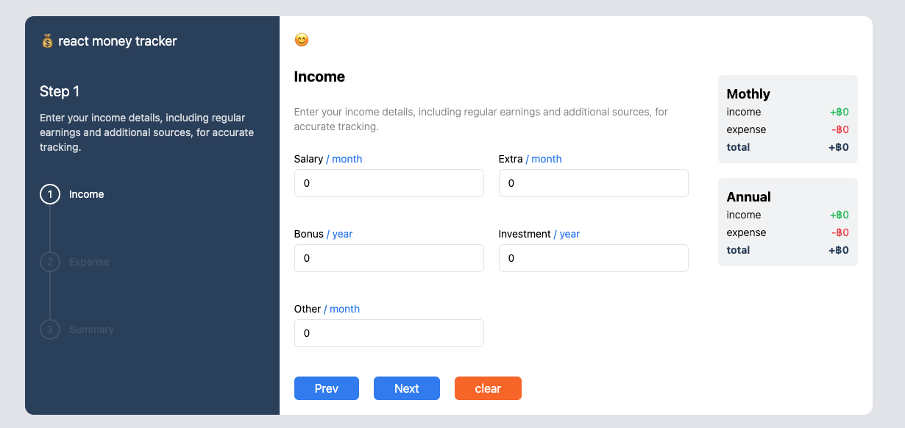
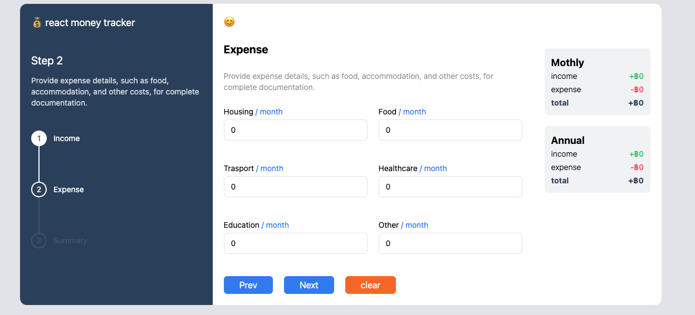
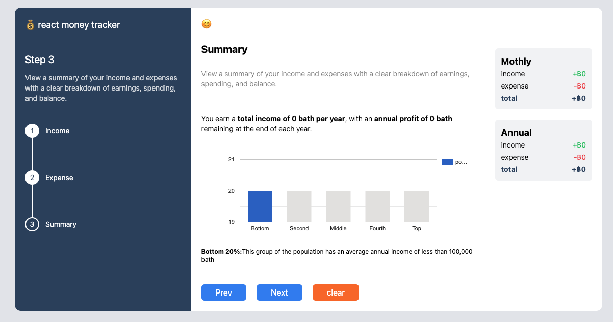

# 💰 React Money Tracker

## 📋 Overview

React Money Tracker is a financial management application designed to help users track their income and expenses. The app summarizes financial data and categorizes users into different income sections, providing a clear understanding of their financial standing.

## 🚀 Features

- **Step-by-step process**: Navigate through income, expense, and summary sections easily.
- **Income tracking**: Enter monthly and yearly income sources.
- **Expense tracking**: Add monthly expenses such as housing, food, and healthcare.
- **Responsive summary**: View a breakdown of annual income and expenses with a categorized chart.
- **Comparison**: See how your financial status compares to others in your group.

## 🛠️ Technologies Used

- **React**
- **Tailwind CSS** for modern, responsive design.
- **JavaScript** for dynamic interaction and calculations.
- **Charts.js** (or similar) for data visualization (if applicable).

## 📦 Installation

To run the project locally:

1. Clone this repository:
   ```bash
   git clone https://github.com/Zlatonn/react-money-tracker.git
   ```
2. Navigate to the project folder:
   ```bash
   cd react-money-tracker
   ```
3. Install dependencies:
   ```bash
   npm Install
   ```
4. Start the development server:
   ```bash
   npm start
   ```

## 🎮 Usage

1. Income Section

- Add income sources (e.g., salary, bonus, investments).
- Monthly and yearly inputs are supported.

2. Expense Section

- Add monthly expenses like housing, food, and transport.
- Easily categorize your spending.

3. Summary Section

- View a detailed breakdown of your income and expenses.
- See your position in the financial distribution chart (e.g., bottom 20%, middle 50%).

## 📸 Screenshots

- Income Page
  
  
  
- Expense Page
  
  
  
- Summary Page
  
  

## 🧑‍💻 Contributors

Zlatonn

## 📜 License

This project is licensed under the MIT License.

## 🌟 Acknowledgements

Design inspired by modern financial tools.
Special thanks to ReactJS and Tailwind CSS communities.
